# TaskManager

## screenshoots

### API Details View

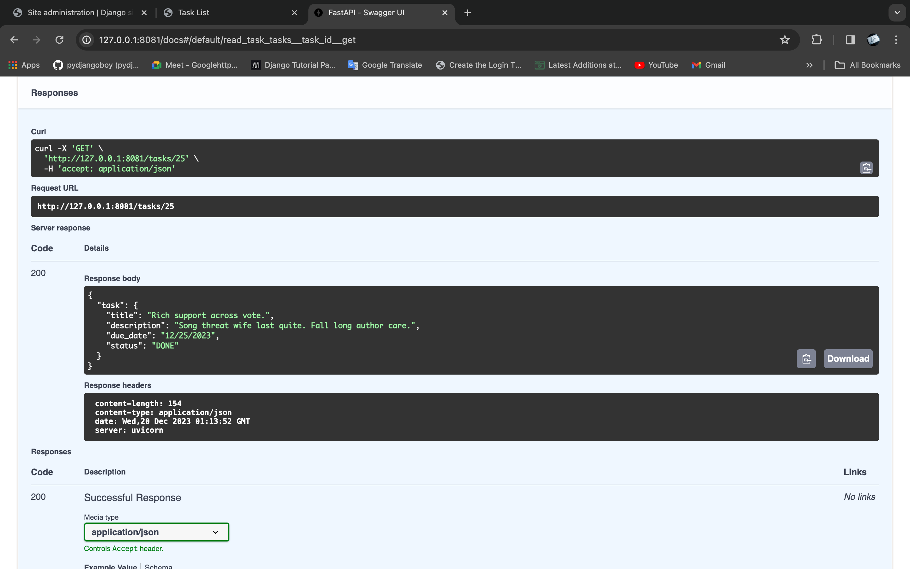

### API List View
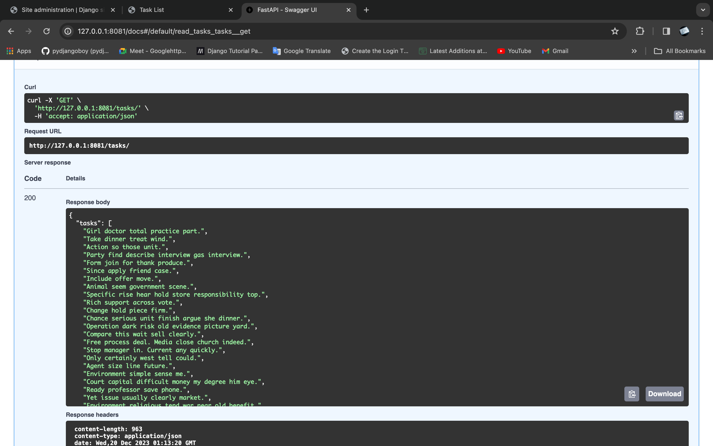

### API Update View 1
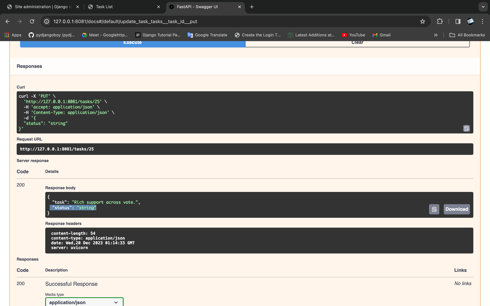

### API Update View 2
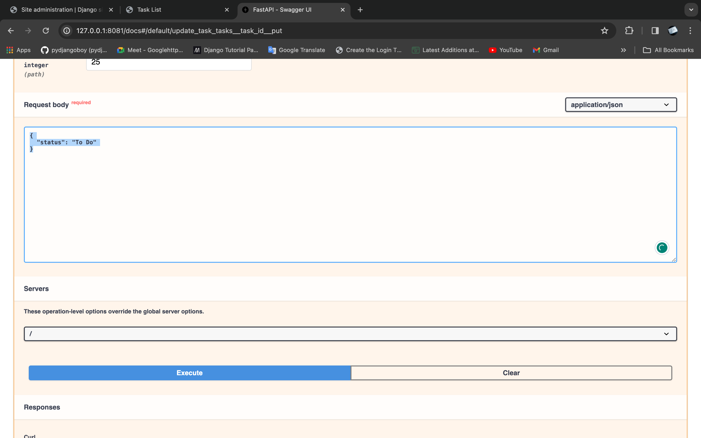

### Create View Page
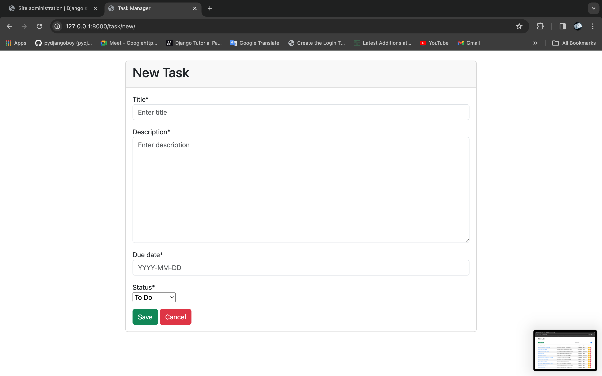

### Delete View Pop Modals
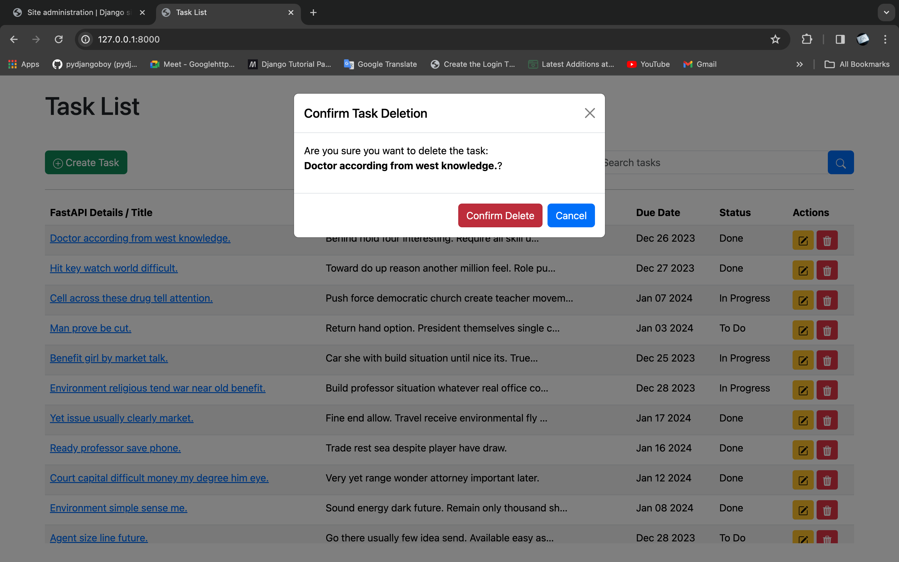

### Edit View Page
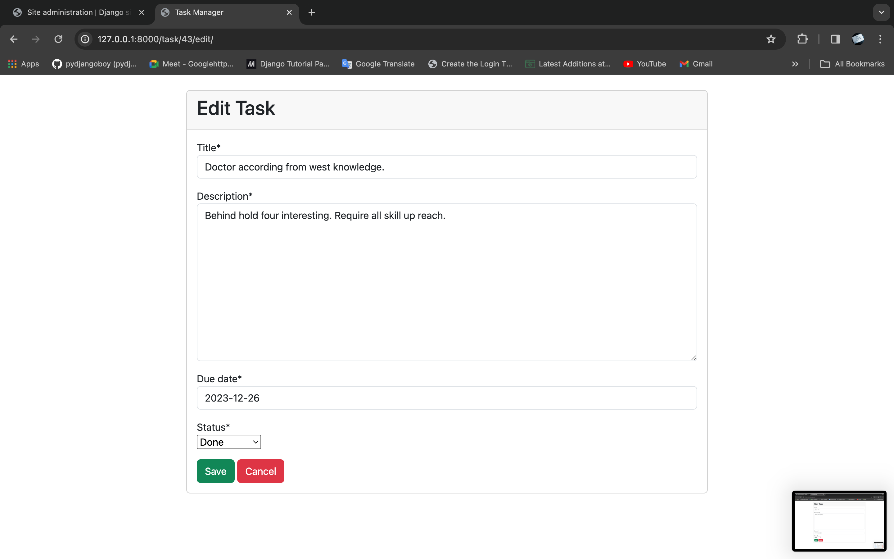

### First Page
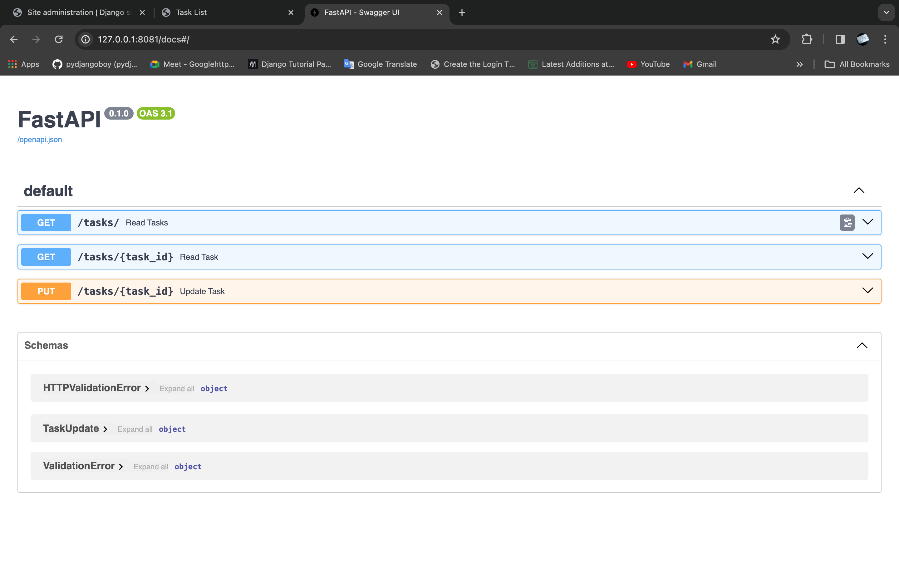

### List View Page
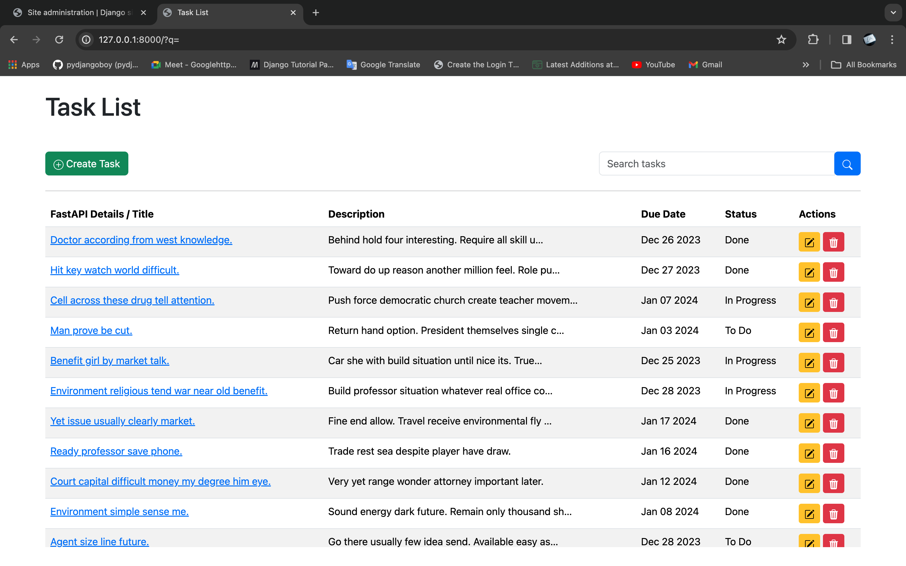

### Search View
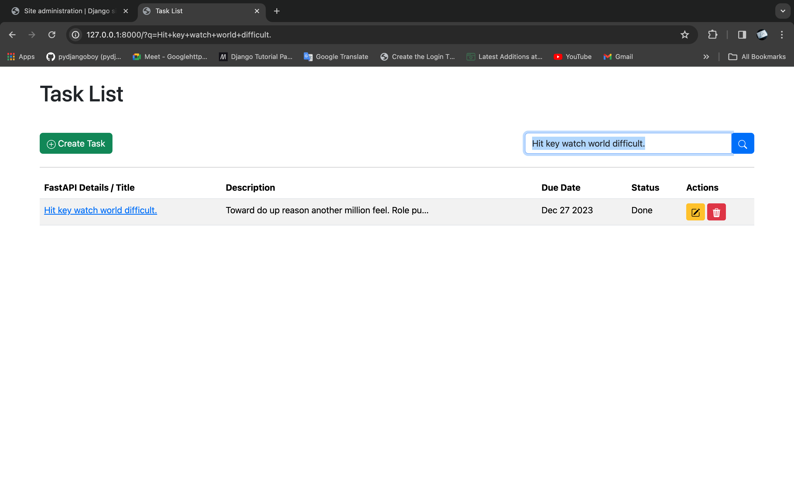

### Update View 3
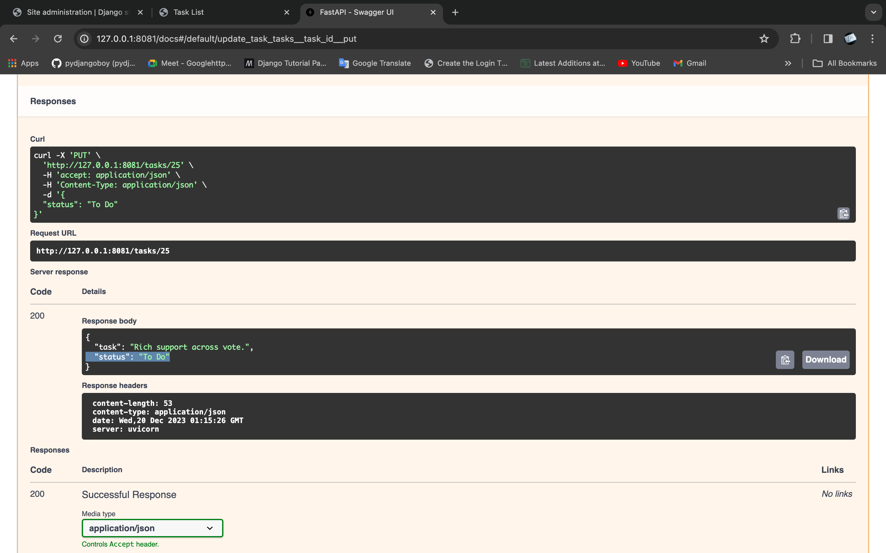

TaskManager is a web application built with Django for managing tasks. It also integrates with a FastAPI API to fetch task details.

## Features

- **List all tasks**: The home page displays a list of all tasks.
- **View details of a task**: Click on a task title to view its details.
- **Create a new task**: Click on the 'New Task' button to create a new task.
- **Edit an existing task**: On the task detail page, click on the 'Edit' button to edit the task.
- **Delete a task**: On the task detail page, click on the 'Delete' button to delete the task.
- **Search for tasks**: Use the search bar at the top of the page to search for tasks.
- **Fetch task details from a FastAPI API**: Click on a task title in the task list to fetch its details from the FastAPI API.

## Setup and Installation

1. **Clone the repository**:
    ```
    git clone https://github.com/pydjangoboy/TaskManager.git
    ```

2. **Navigate to the project directory**:
    ```
    cd TaskManager
    ```

3. **Install the required dependencies**:
    ```
    pip install -r requirements.txt
    ```

4. **Run the Django migrations**:
    ```
    python manage.py migrate
    ```

5. **Start the Django server**:
    ```
    python manage.py runserver
    ```

6. **Navigate to the FastAPI application directory** (replace `path_to_fastapi_app` with the actual path):
    ```
    cd Tasks  --> fastapi.py
    ```

7. **Install the FastAPI application dependencies** (if any):
    ```
    pip install -r requirements.txt
    ```

8. **Start the FastAPI server on port 8081**:
    ```
     uvicorn Tasks.fastapi:app --host 0.0.0.0 --port 8081
    ```

After following these steps, you can navigate to `http://127.0.0.1:8000/` in your browser to view the Django application and to `http://127.0.0.1:8081/` to view the FastAPI application.

## Usage

- **View all tasks**: Navigate to the home page.
- **View details of a task**: Click on the task title.
- **Create a new task**: Click on the 'New Task' button.
- **Edit an existing task**: Click on the 'Edit' button on the task detail page.
- **Delete a task**: Click on the 'Delete' button on the task detail page.
- **Search for a task**: Use the search bar at the top of the page.
- **View FastAPI task details**: Click on the task title in the task list.


